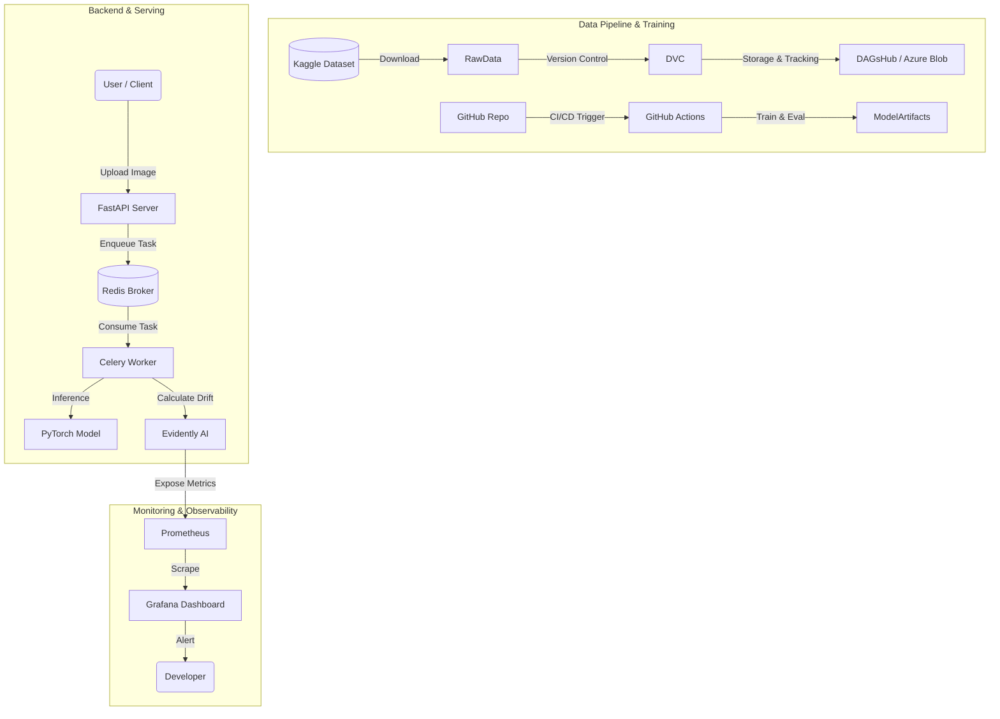

# 🚀 End-to-End MLOps: Image Defect Detection System


Hệ thống **phát hiện lỗi sản phẩm (Image Defect Detection)** tự động sử dụng **Deep Learning**, được thiết kế theo chuẩn **End-to-End MLOps**: từ quản lý dữ liệu, huấn luyện, CI/CD, đến giám sát hiệu năng mô hình (Model & Data Drift) theo thời gian thực.

---

## 🏗️ System Architecture

Luồng tổng thể của hệ thống từ dữ liệu → huấn luyện → serving → monitoring:



---

## 🛠️ Tech Stack

| Hạng mục         | Công nghệ                | Vai trò                                        |
| ---------------- | ------------------------ | ---------------------------------------------- |
| Backend API      | **FastAPI**              | Xử lý request, phục vụ mô hình (Model Serving) |
| Async Task       | **Celery + Redis**       | Xử lý inference & drift check dưới background  |
| Machine Learning | **PyTorch**              | Huấn luyện & inference mô hình Segmentation    |
| Data Versioning  | **DVC + DAGsHub**        | Versioning dữ liệu & tracking thí nghiệm       |
| Source Data      | **Kaggle**               | Dữ liệu huấn luyện ban đầu                     |
| Cloud Storage    | **Azure Blob Storage**   | Remote storage cho DVC / Artifacts             |
| CI/CD            | **GitHub Actions**       | Tự động test, train, build Docker              |
| Monitoring       | **Evidently AI**         | Phát hiện Data Drift & Model Drift             |
| Observability    | **Prometheus + Grafana** | Thu thập metrics & dashboard                   |

---

## ✨ Features

* **Defect Detection API**
  Upload ảnh sản phẩm và trả về:

  * Mask vị trí lỗi (Segmentation)
  * Loại lỗi (Scratch, Stain, v.v.)

* **Asynchronous Processing**
  Inference và drift check được xử lý bằng **Celery Worker** để giảm latency cho API.

* **Real-time Monitoring**

  * Phát hiện **Input Drift** khi ảnh người dùng khác biệt so với dữ liệu train.
  * Giám sát **Output Drift** để đánh giá độ tin cậy của mô hình.
  * Tự động cảnh báo khi drift vượt ngưỡng an toàn.

* **Reproducibility**

  * Dữ liệu và model được versioning bằng **DVC**.
  * Có thể tái hiện lại bất kỳ phiên bản mô hình nào trong quá khứ.

---

## 📂 Project Structure

```bash
├── .github/workflows/        # CI/CD pipelines (GitHub Actions)
├── backend/
│   ├── src/
│   │   ├── api/              # FastAPI controllers
│   │   ├── core/             # Configs (Redis, Celery)
│   │   ├── monitor/          # Evidently AI logic
│   │   └── models/           # PyTorch model architectures
│   ├── Dockerfile.api
│   ├── prometheus.yml        # Prometheus config
│   └── requirements.txt
├── data/                     # DVC-tracked data (symlinks)
├── scripts/                  # Training & feature extraction scripts
├── docker-compose.yml        # Orchestration (API, Redis, Worker, Prom, Grafana)
├── dvc.yaml                  # DVC pipeline stages
└── README.md
```

---

## 🚀 Installation & Run

### 1. Prerequisites

* Docker & Docker Compose
* Python **3.10+**
* Tài khoản **DAGsHub** hoặc **Azure Blob Storage** (để pull data/model)

### 2. Clone & Setup Environment

```bash
git clone https://github.com/your-username/your-repo.git
cd your-repo

# (Optional) Create virtual environment
python -m venv venv
source venv/bin/activate
pip install -r backend/requirements.txt
```

### 3. Pull Data & Model (DVC)

```bash
# Configure remote (example)
dvc remote add -d myremote s3://your-bucket/path

# Pull data & artifacts
dvc pull
```

### 4. Run Full Stack (Docker Compose)

```bash
docker-compose up -d --build
```

Sau khi khởi chạy thành công:

* **FastAPI Docs**: [http://localhost:5000/docs](http://localhost:5000/docs)
* **Grafana Dashboard**: [http://localhost:3000](http://localhost:3000)
  *(default: admin / admin)*
* **Prometheus**: [http://localhost:9090](http://localhost:9090)

---

## 📊 Monitoring Dashboard

Grafana dashboard cung cấp cái nhìn tổng quan về sức khỏe mô hình:

* **Drift Score Gauge**

  * 🟢 `< 0.3`: An toàn
  * 🟠 `0.3 – 0.5`: Theo dõi
  * 🔴 `> 0.5`: Cảnh báo – nên retrain mô hình

* **Feature Drift Analysis**

  * Brightness
  * Contrast
  * Mask Area

---

## 🤖 CI/CD Workflow (GitHub Actions)

Mỗi lần push code lên nhánh `main`:

1. **Lint & Test** – kiểm tra code style và unit tests
2. **DVC Check** – đảm bảo dữ liệu & pipeline hợp lệ
3. **Build Docker Image** – build image cho backend
4. *(Optional)* **Deploy** – đẩy image lên Azure Container Registry / Cloud

---

## 📌 Roadmap (Optional)

* [ ] Online / Continual Learning
* [ ] Model Registry (MLflow)
* [ ] Canary Deployment cho model mới
* [ ] Auto Retraining khi drift vượt ngưỡng

---

⭐ Nếu bạn thấy dự án hữu ích, hãy cho repo một **star** để ủng hộ nhé!
